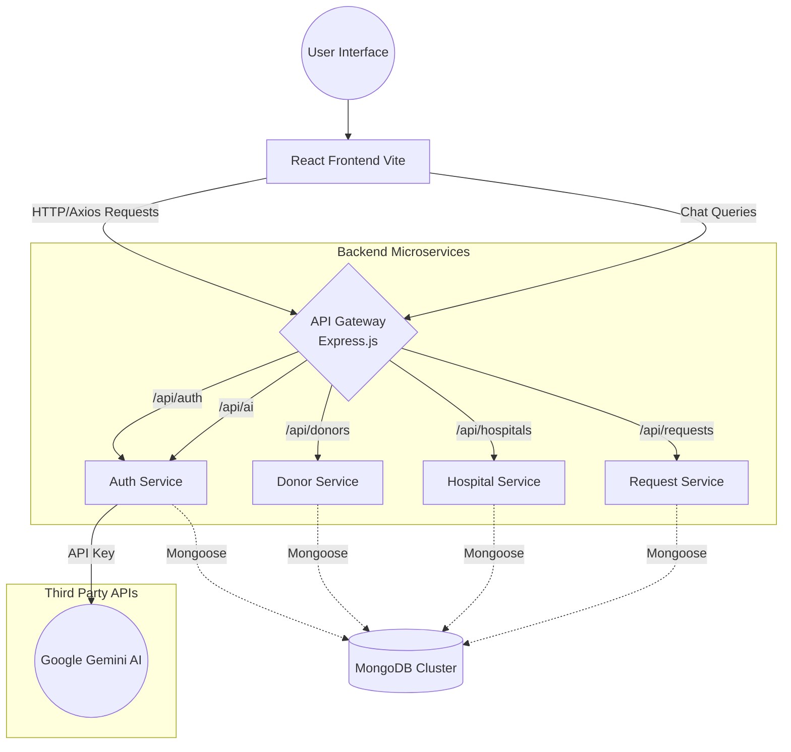
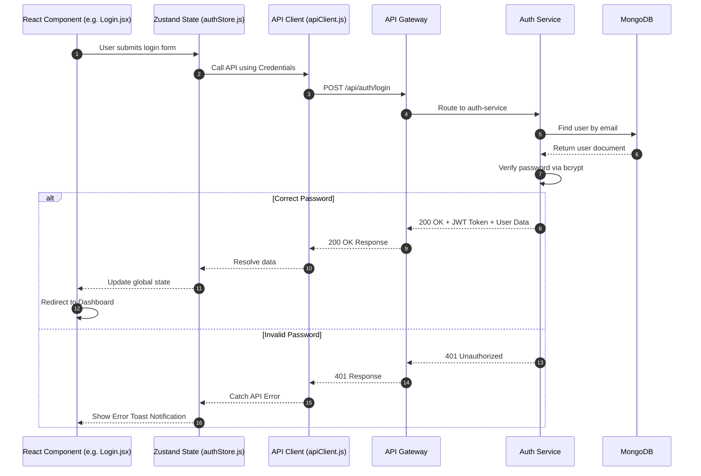

# DonorNet Architecture Diagrams

These diagrams visualize the architecture and data flow of the DonorNet application to help you grasp the workflow quickly for interviews.

## High-Level Architecture
This diagram shows the broad system components (Frontend, API Gateway, Microservices, and Databases) and how they communicate.

---

## Low-Level Component Workflow
This sequence diagram shows exactly how data flows from a React component, through the centralized state, across the network using Axios, routed by the API Gateway, processed by a microservice, saved in MongoDB, and finally reflected back on the screen.

> [!TIP]
> **Explaining the Workflow in an Interview:** 
> "In DonorNet, when a user interacts with a React component, we update the UI state using **Zustand**. For data fetching, we leverage **Axios** to hit an **Express.js API Gateway**. The API Gateway doesn't handle business logic; it merely routes the request to the appropriate **Microservice** (like Auth or Request service). The microservice processes the logic, queries **MongoDB using Mongoose**, and sends a JSON response back through the gateway to the frontend, which handles the final React render."
